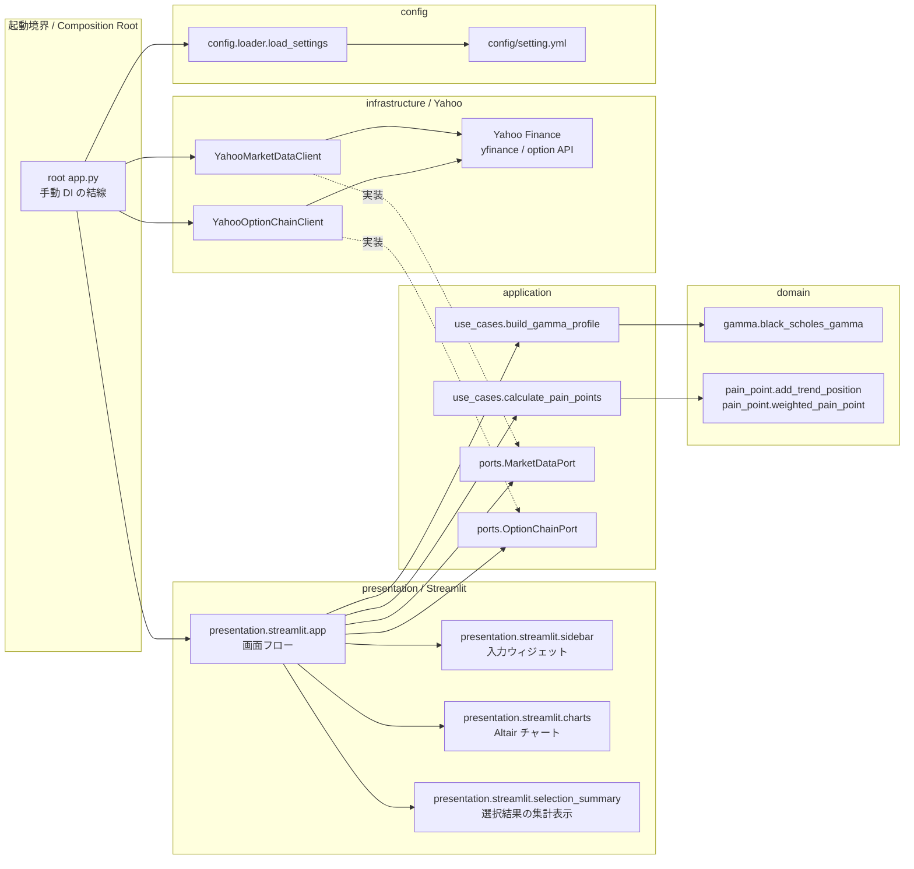

# アーキテクチャ

`index_analysis` は Clean Architecture 寄りの層分離を採用します。
内側の層ほど金融計算やユースケースの本質に近く、外側の層ほど UI や外部サービスに近い責務を持ちます。

## 依存ルール

基本の依存方向は以下です。

```text
presentation -> application -> domain
infrastructure -> application ports
```

ドメイン層は設定ファイル、Streamlit、Yahoo Finance、HTTP クライアントを知りません。
アプリケーション層はユースケースとポートを持ちます。
インフラストラクチャ層はポートを満たす具体実装として外部サービスに接続します。

## コンポーネント図



`root app.py` はアプリケーションの起動境界であり、Composition Root です。
起動時に依存関係を組み立てるため、設定読み込み、具体的なインフラストラクチャクライアント、プレゼンテーション層を意図的に import します。
この境界は手動 DI の結線点であり、通常のプレゼンテーションコンポーネントではありません。

## レイヤー

### ドメイン層

ドメイン層は金融計算だけを扱います。

- `index_analysis.domain.gamma`
  - `black_scholes_gamma`
- `index_analysis.domain.pain_point`
  - `add_trend_position`
  - `weighted_pain_point`

ドメイン層の関数は必要なパラメータをすべて明示的に受け取ります。
`load_settings()`、`yfinance`、`requests`、Streamlit は呼び出しません。

### アプリケーション層

アプリケーション層は、アプリケーションが何を計算し、データをどのように組み合わせるかを表します。

- `index_analysis.application.use_cases.calculate_pain_points`
  - 価格データの対象期間を決定します。
  - コホートの開始日を決定します。
  - 価格データとトレンドフォロワーのポジション推定値を組み合わせます。
- `index_analysis.application.use_cases.build_gamma_profile`
  - スポット価格ごとのガンマエクスポージャーを構築します。
  - `contract_size` と `risk_free_rate` は外側から受け取ります。
- `index_analysis.application.ports.market_data_port`
  - `MarketDataPort` を定義します。
- `index_analysis.application.ports.option_chain_port`
  - `OptionChainPort` を定義します。

ユースケースはドメイン層に依存できます。
ユースケースは Yahoo Finance、Streamlit、具体的なインフラストラクチャクラスに依存しません。

### インフラストラクチャ層

インフラストラクチャ層は外部サービスへのアダプターを持ちます。

- `index_analysis.infrastructure.yahoo.yahoo_market_data`
  - `YahooMarketDataClient`
  - `MarketDataPort` を実装します。
  - `yfinance` を使用します。
- `index_analysis.infrastructure.yahoo.yahoo_option_chain`
  - `YahooOptionChainClient`
  - `OptionChainPort` を実装します。
  - `yfinance` と、`requests` 経由の Yahoo Finance option API を使用します。

インフラストラクチャ層は内側のアプリケーションポートに依存します。
アプリケーション側のコードは、同じポートを実装する別のデータプロバイダに Yahoo クライアントを置き換えられるようにします。

### プレゼンテーション層

プレゼンテーション層は Streamlit とチャート、UI に関する責務を持ちます。

- `index_analysis.presentation.streamlit.sidebar`
  - サイドバー入力を扱います。
- `index_analysis.presentation.streamlit.charts`
  - Altair チャートを生成します。
- `index_analysis.presentation.streamlit.selection_summary`
  - データテーブルの選択内容を集計し、表示します。
- `index_analysis.presentation.streamlit.app`
  - 画面全体のフローを扱います。
  - 設定値と外部クライアントを root `app.py` から受け取ります。
  - 具体的な Yahoo クライアントではなく、`MarketDataPort` と `OptionChainPort` の型に依存します。

プレゼンテーション層は具体的な外部サービスアダプターから独立させます。
root `app.py` は薄い Composition Root と起動境界に保ちます。
root `app.py` は設定値、ポートの具体実装、プレゼンテーション層を結線します。

## 外部依存

外部依存は意図的に外側の層へ閉じ込めます。

- Streamlit: プレゼンテーション層
- Altair: プレゼンテーション層
- yfinance: インフラストラクチャ層
- requests: インフラストラクチャ層
- PyYAML: 設定読み込み
- pandas: 現在の実装で層をまたいで使うデータ構造

## 設計メモ

- ポートは、置き換え可能な外部依存に対してのみ導入します。
- Yahoo Finance は `MarketDataPort` と `OptionChainPort` の背後に置きます。
- Yahoo クライアントはアプリケーションポートを実装し、`yfinance` と `requests` はインフラストラクチャ層の中に閉じ込めます。
- ドメイン層は設定と外部サービスから独立させます。
- アプリケーション層は設定値を呼び出し元から受け取り、設定を直接 import しません。
- プレゼンテーション層は UI の表示形式とチャート描画を担当します。
- DI コンテナは使いません。root `app.py` が手動で依存関係を注入します。
