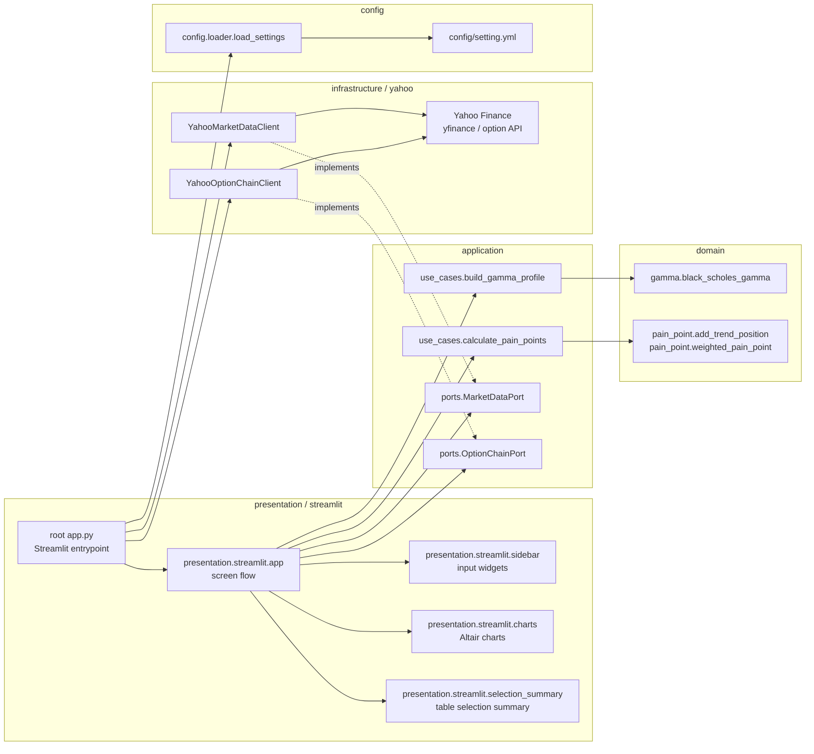

# Architecture

`index_analysis` はClean Architecture寄りの層分離を採用します。
内側の層ほど金融計算やユースケースの本質に近く、外側の層ほどUIや外部サービスに近い責務を持ちます。

## Dependency Rule

基本の依存方向は以下です。

```text
presentation -> application -> domain
infrastructure -> application ports
```

Domain は設定ファイル、Streamlit、Yahoo Finance、HTTP clientを知りません。
Application はUse CaseとPortを持ちます。
Infrastructure はPortを満たす具体実装として外部サービスに接続します。

## Component Diagram



## Layers

### Domain

Domain contains financial calculations only.

- `index_analysis.domain.gamma`
  - `black_scholes_gamma`
- `index_analysis.domain.pain_point`
  - `add_trend_position`
  - `weighted_pain_point`

Domain functions receive all parameters explicitly.
They do not call `load_settings()`, `yfinance`, `requests`, or Streamlit.

### Application

Application describes what the app calculates and how data is combined.

- `index_analysis.application.use_cases.calculate_pain_points`
  - Chooses the price window.
  - Chooses cohort start dates.
  - Combines price data with trend-followers position proxy.
- `index_analysis.application.use_cases.build_gamma_profile`
  - Builds spot-level gamma exposure profile.
  - Receives `contract_size` and `risk_free_rate` from outside.
- `index_analysis.application.ports.market_data_port`
  - Defines `MarketDataPort`.
- `index_analysis.application.ports.option_chain_port`
  - Defines `OptionChainPort`.

Use Cases may depend on Domain.
Use Cases should not depend on Yahoo Finance, Streamlit, or concrete infrastructure classes.

### Infrastructure

Infrastructure contains external service adapters.

- `index_analysis.infrastructure.yahoo.yahoo_market_data`
  - `YahooMarketDataClient`
  - Implements `MarketDataPort`.
  - Uses `yfinance`.
- `index_analysis.infrastructure.yahoo.yahoo_option_chain`
  - `YahooOptionChainClient`
  - Implements `OptionChainPort`.
  - Uses `yfinance` and Yahoo Finance option API via `requests`.

Infrastructure depends inward on Application Ports.
The application code should be able to replace Yahoo clients with another data provider implementing the same Port.

### Presentation

Presentation contains Streamlit and chart/UI concerns.

- `index_analysis.presentation.streamlit.sidebar`
  - Sidebar inputs.
- `index_analysis.presentation.streamlit.charts`
  - Altair chart generation.
- `index_analysis.presentation.streamlit.selection_summary`
  - Data table selection aggregation and rendering.
- `index_analysis.presentation.streamlit.app`
  - Overall screen flow.
  - Receives settings and external clients from root `app.py`.

The root `app.py` should remain a thin Streamlit entrypoint and composition root.
It wires settings, ports, infrastructure implementations, use cases, and presentation.

## External Dependencies

External dependencies are intentionally kept at the outer layers.

- Streamlit: Presentation
- Altair: Presentation
- yfinance: Infrastructure
- requests: Infrastructure
- PyYAML: Config loading
- pandas: Cross-layer data structure used by current implementation

## Design Notes

- Ports are only introduced for replaceable external dependencies.
- Yahoo Finance is behind `MarketDataPort` and `OptionChainPort`.
- Domain is independent of configuration and external services.
- Application receives setting values from the caller instead of importing configuration directly.
- Presentation owns UI formatting and chart rendering.
